# System Diagrams (Mermaid) — RFS Report Finder System

> Diagram รวมทั้งระบบ — architecture, data model (ERD), sequence, state, deployment ทุกไดอะแกรมสอดคล้องกับ [system-design.md](01-system-design.md) และ [workflow.md](./workflow.md) หัวข้อย่อยตรงกันเพื่อให้ลิงก์ข้ามเอกสารใช้งานได้ (`workflow.md` มีลิงก์อ้างมาที่หัวข้อในไฟล์นี้)
>
> Diagram แสดงสถานะ **เป้าหมายรวมทุก phase** — ส่วนที่เป็นสีเทาในคำอธิบาย (❌/Phase 2-4) คือของที่ยังไม่มีในโค้ดจริงวันนี้

---

## 1. System Architecture

### 1.1 Container / Component View

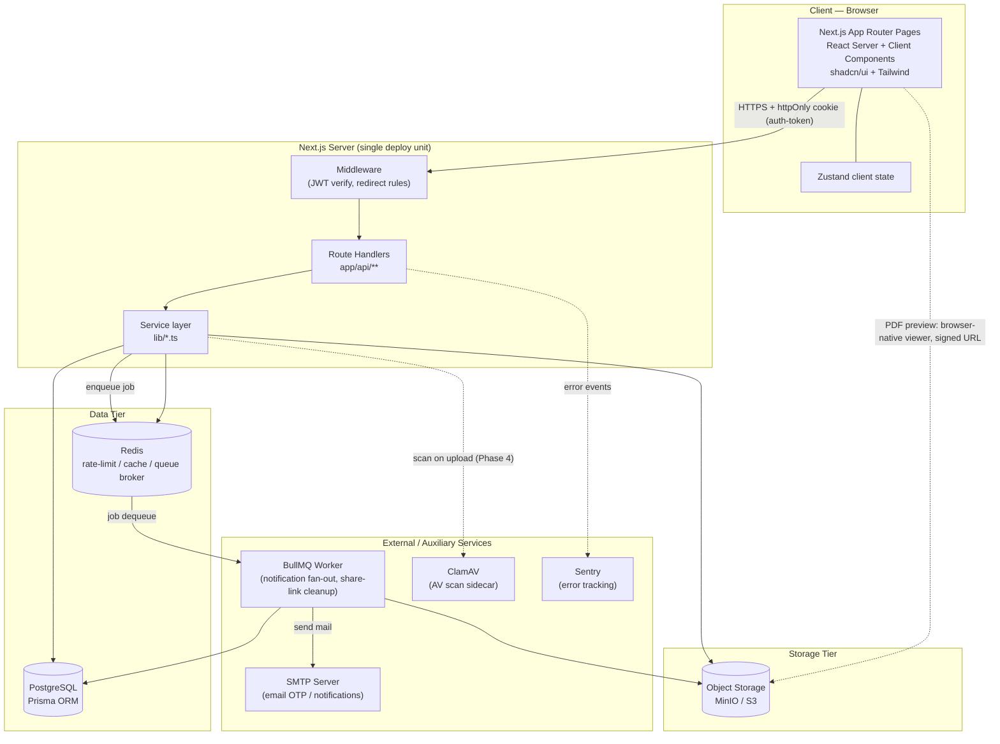

### 1.2 Layered Backend View (Request Lifecycle)

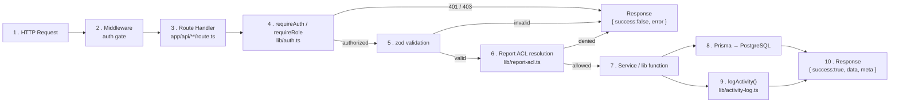

---

## 2. Data Model (ERD)

Schema แบ่งเป็น 2 กลุ่มเพื่อความอ่านง่าย: **Identity/RBAC** และ **Report Domain** ทุกตารางที่มี prefix "(new)" ในคำอธิบายคือส่วนต่อขยาย Phase 2 ที่ยังไม่มีในโค้ดจริง

### 2.1 Identity, RBAC & Cross-Cutting

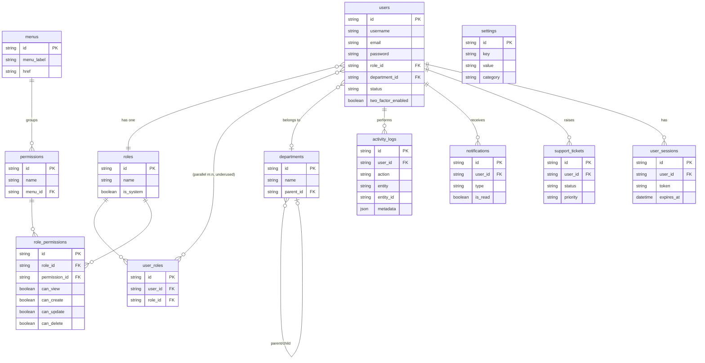

### 2.2 Report Domain (current + Phase 2 extensions)

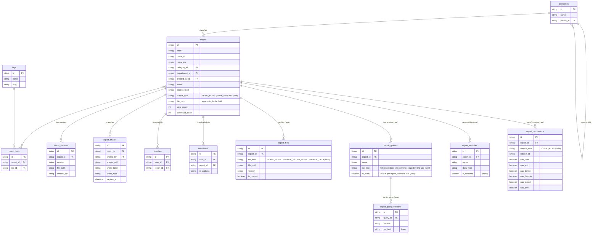

---

## 3. Component / Module Diagram (Frontend)

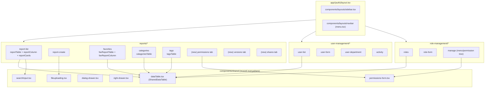

---

## 4. Sequence Diagrams

### 4.1 Sequence — Login

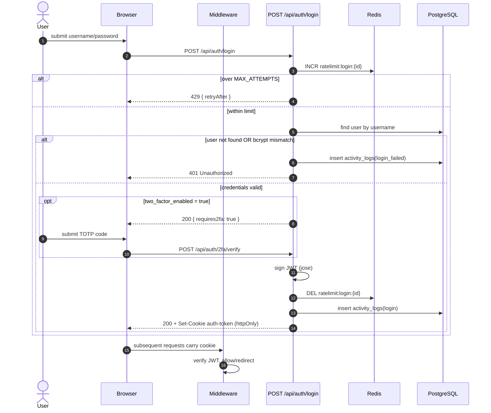

### 4.2 Sequence — Report Search / ACL Filter

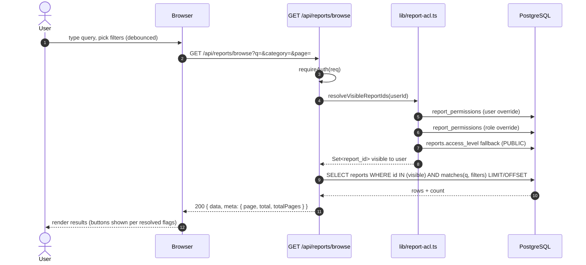

### 4.3 Sequence — Report Create with File Upload & Versioning

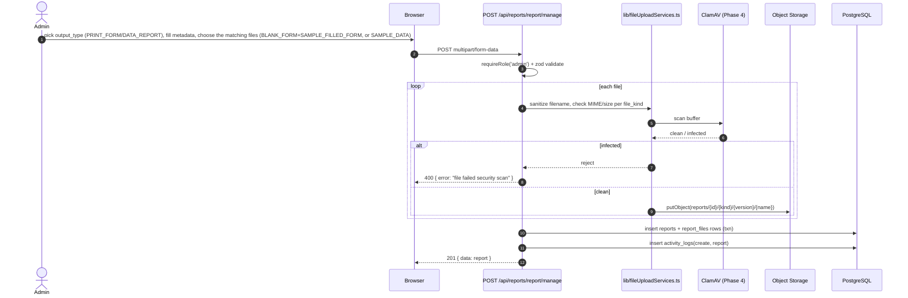

### 4.4 Sequence — Download / Export (no rendering — direct file serve)

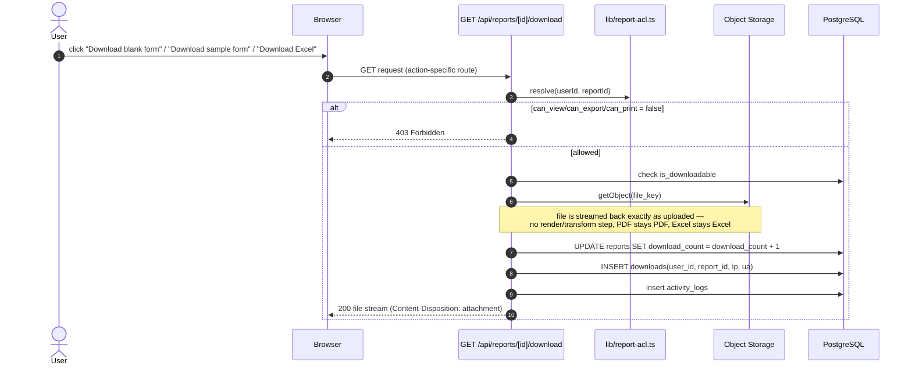

### 4.4b Sequence — In-App Preview & Print (PDF vs Excel Table)

```mermaid
sequenceDiagram
    autonumber
    actor U as User
    participant B as Browser
    participant API as GET /api/reports/[id]/preview
    participant ACL as lib/report-acl.ts
    participant OS as Object Storage
    participant EX as lib/preview.ts (exceljs, read-only)

    U->>B: click "Preview"
    B->>API: request (only for DATA_REPORT; PRINT_FORM skips API entirely)
    alt output_type = PRINT_FORM
        B->>B: render BLANK_FORM / SAMPLE_FILLED_FORM signed URL in native <iframe> PDF viewer
        U->>B: click browser's print icon (or Ctrl+P)
        B->>B: browser prints the PDF as-is — no backend call
    else output_type = DATA_REPORT
        API->>ACL: resolve(userId, reportId), check can_view
        API->>OS: getObject(SAMPLE_DATA file key)
        API->>EX: parse workbook, first sheet, cap N rows
        EX-->>API: { columns, rows }
        API-->>B: 200 { columns, rows }
        B->>B: render SharedDataTable
        U->>B: click "Print"
        B->>B: window.print() on @media print layout of the table — no backend call
    end
```

### 4.5 Sequence — Report Sharing

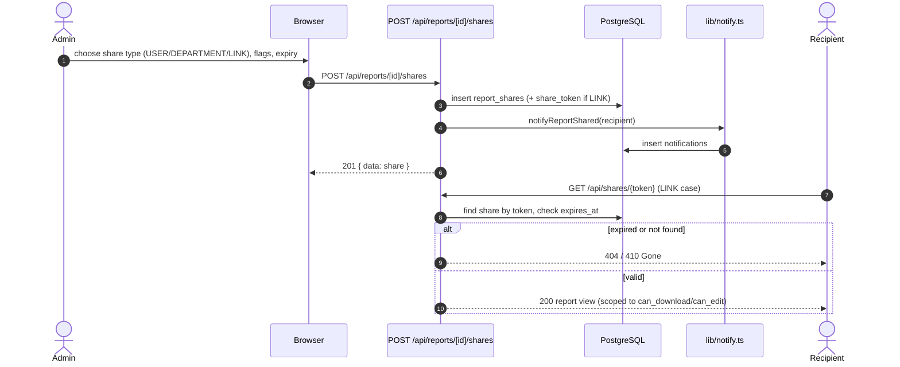

### 4.6 Flowchart — Permission Resolution

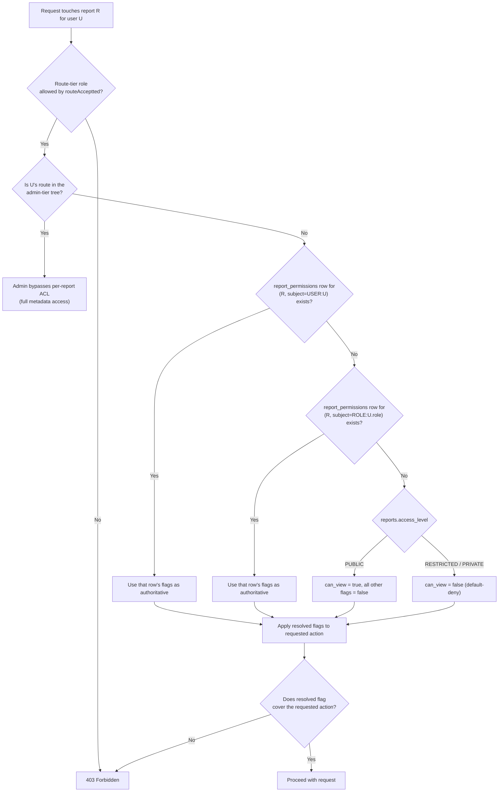

---

## 5. State Diagrams

### 5.1 State — Report Status Lifecycle

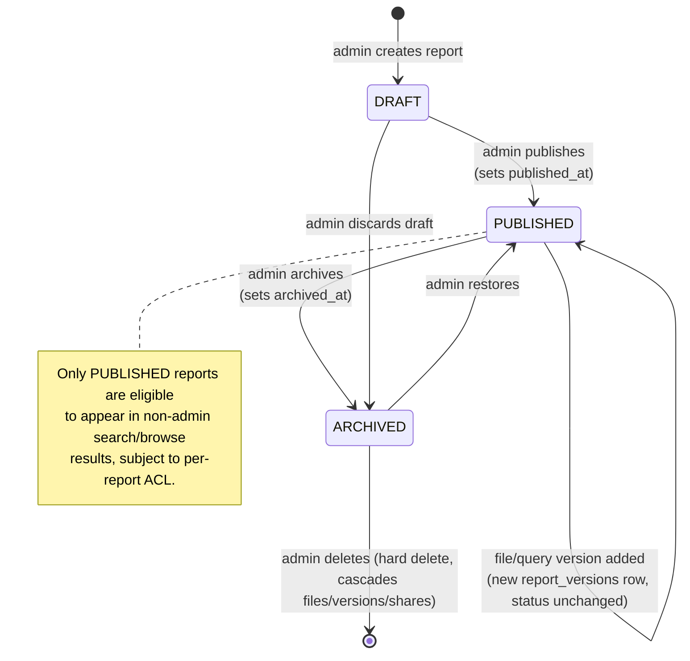

### 5.2 State — Report Share Link Lifecycle

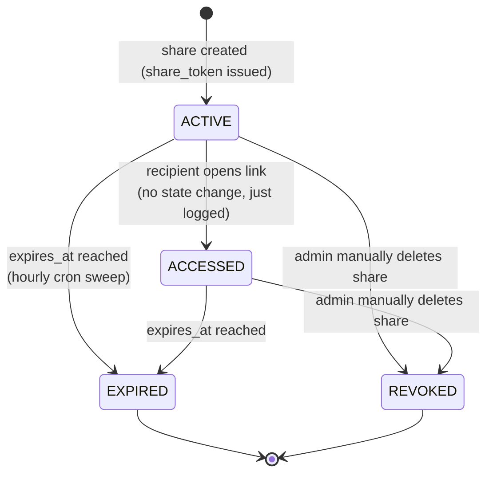

### 5.3 State — Support Ticket Lifecycle (if kept in scope)

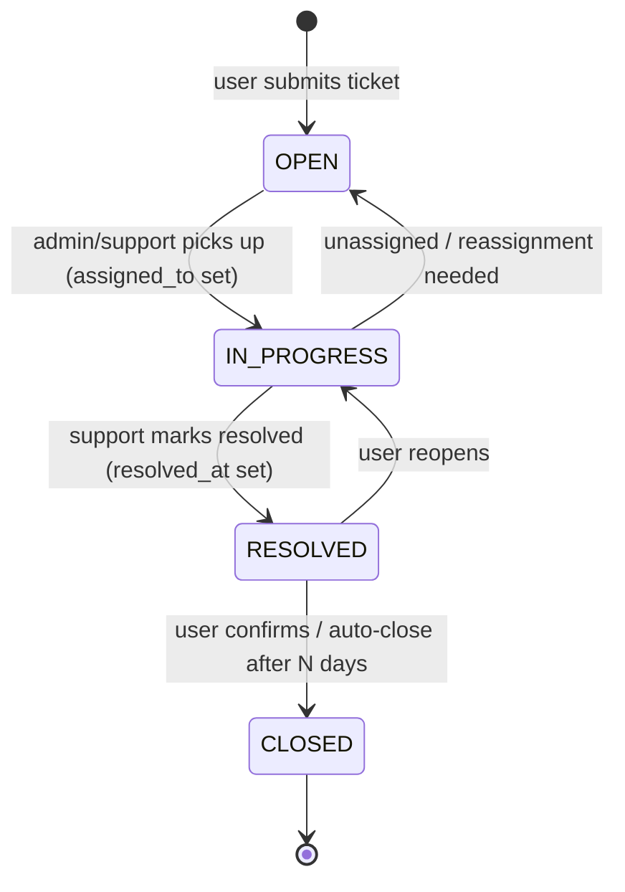

---

## 6. Deployment Diagram

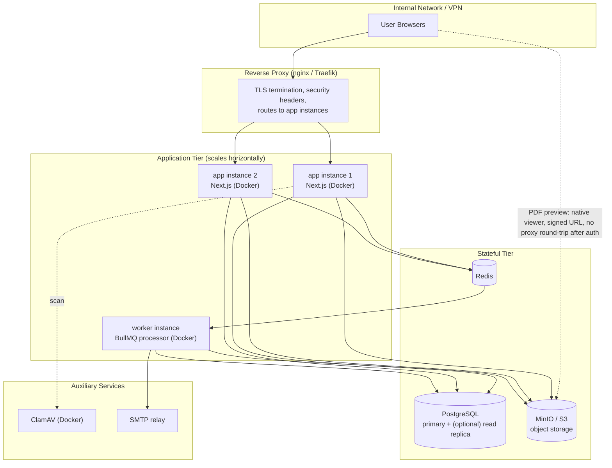

---

## 7. Report-Level Permission Data Shape (Class-style)

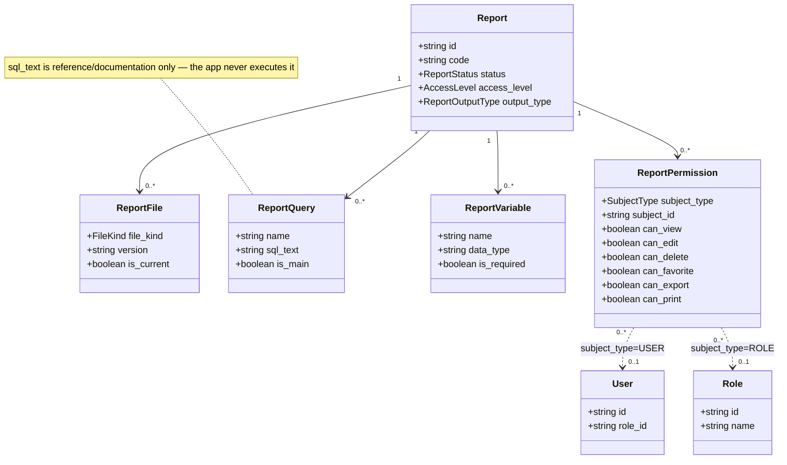
